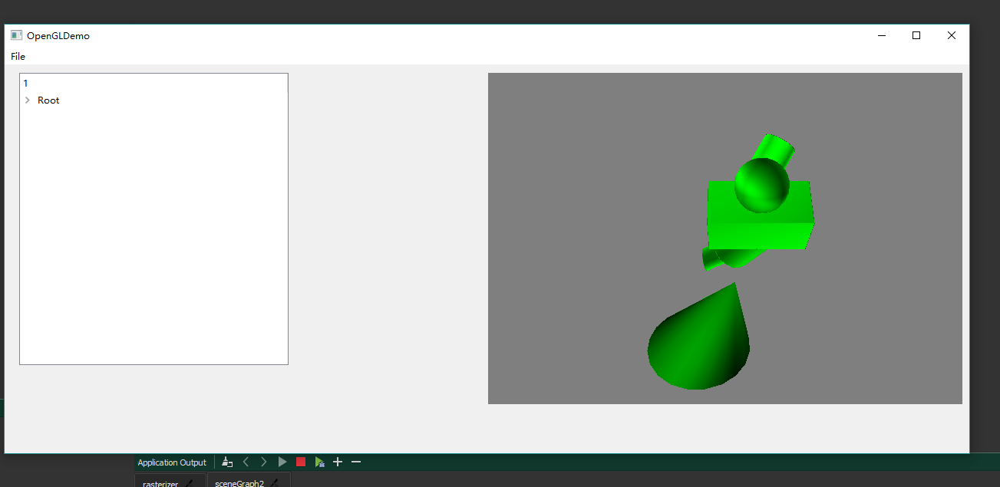
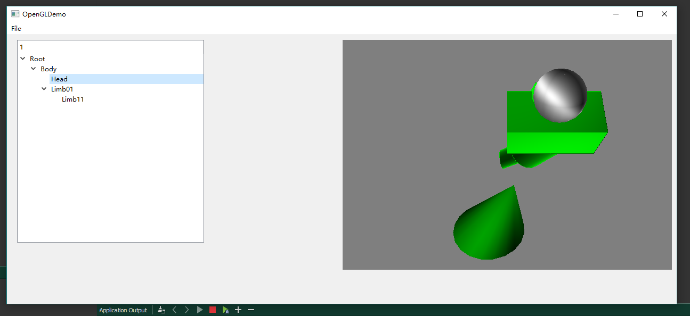

# ComputerGraphics_QT_HW04_SceneGraph
coding and building scene graph, using OpenGL functions to pass geometry from CPU to your GPU, writing GLSL shader code, and adding a simple Qt GUI element to display nodes.
# Description
`C++` `OpenGL4.0` `Qt Creator`

* Scene Graph Classes
* Scene Graph Traversal
* Polygon Primitives with Vertex Buffer Objects
* Character
* Fragment shader: Lambertian reflection
* Qt GUI: QTreeWidget

# Screenshots and Results

**When you Select a node**

